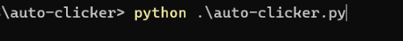

# Auto Clicker

*Auto clicker program created in python.*

## Running the code

### *How to run*

You must be located in the folder containing the script and running the command: *python .\auto-clicker.py*.
To start the clicking process, just hover the mouse to a location where it should click, and press *s*, and it will start clicking.
Stoping the execution is just pressing the letter *e*.
